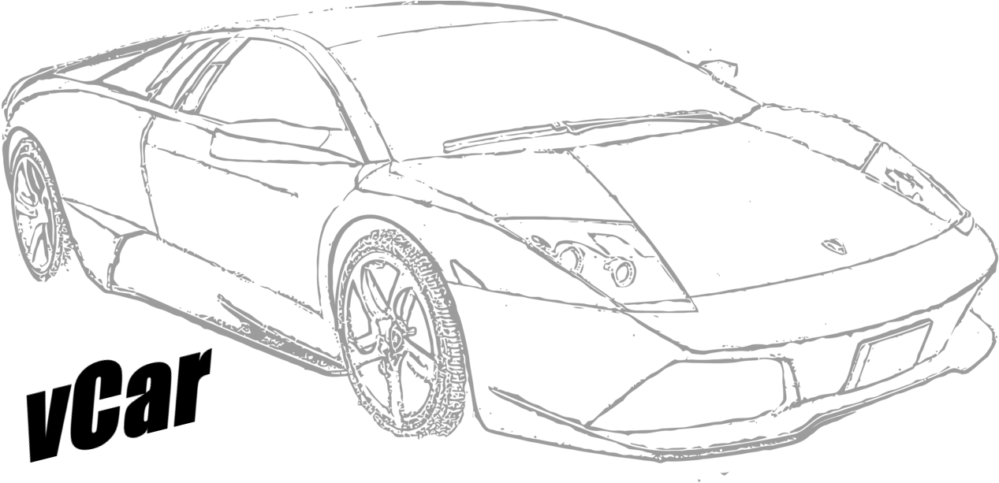

<p align="center"></p>

# vCar
*Still a work in progress*
Fully functional and customizable virtual car environment built for pentesters 

## Requirements
* linux
* cmake >= 3.0
* python >= 3.0

## How to use
This project consists of two components, the web interface and the embedded code. Pull this repo to get started.

### 1. Launch the embedded code
Make sure you're in the root directory and run the following commands:
```
sudo ./configure.sh
cd src
mkdir build
cd build
cmake ..
make all
./vcar-server
```
The `configure.sh` file will start up the virtual can network on your machine, the rest will compile and run the main vCar component

### 2. Launch the web application
Open up a new terminal and change to the root directory then run the following commands:
```
cd web
python3 main.py
```
You may need to install required dependencies as prompted by the python interpreter.

### 3. Open up the web app
Once you have both components running, go to `http://localhost:5000` in your browser. Here you can start sending CAN frames to the car.

### Example CAN frames
```
ACTION_DOOR_UNLOCK                  001#0000000000000000
ACTION_DOOR_LOCK                    001#0000000000000001
ACTION_DOOR_WINDOW_DOWN             001#0000000000000002
ACTION_DOOR_WINDOW_UP               001#0000000000000003
ACTION_DOOR_WINDOW_STOP             001#0000000000000004
ACTION_DOOR_TOGGLE_CHILD_LOCK       001#0000000000000005

ACTION_SCU_DISABLE_CRUISE_CONTROL   002#0000000000000000
ACTION_SCU_ENABLE_CRUISE_CONTROL    002#0000000000000001
```
